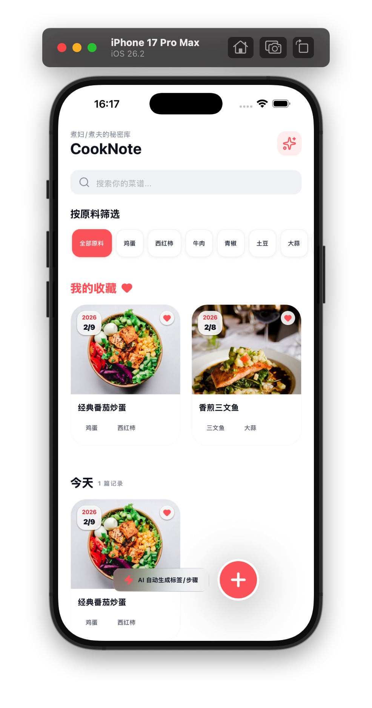
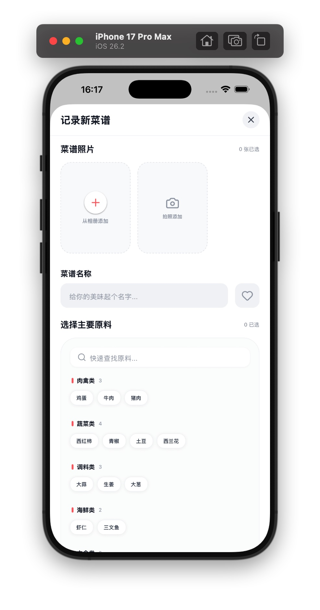

# CookNote 🍳

[](https://expo.dev/)
[](https://reactnative.dev/)
[](https://www.nativewind.dev/)
[](LICENSE)

**CookNote** 是一款基于 Expo 和 React Native 开发的现代化个人菜谱管理应用。它旨在帮助每一位美食爱好者轻松记录、分类和回顾自己的烹饪心得，并预留了强大的 AI 扩展能力。

<p align="center">
  
  
</p>

## ✨ 核心特性

- 📸 **全方位记录**：支持多图上传，记录烹饪的每一个精彩瞬间。
- 🏷️ **智能筛选**：通过食材标签快速查找菜谱，再也不用担心“家里剩了这些菜能做什么”。
- ❤️ **个性收藏**：置顶你最爱的美味，随时查看。
- 📅 **时光轴展示**：按时间轴优雅地展示你的烹饪历程。
- 🧪 **AI 实验室 (规划中)**：计划集成 AI 图像识别食材、语音转烹饪步骤以及智能每日推荐。
- 📱 **跨平台支持**：支持 iOS、Android 和 Web。

## 🛠️ 技术栈

- **框架**: [Expo SDK 54](https://expo.dev/)
- **UI 框架**: [NativeWind (Tailwind CSS for React Native)](https://www.nativewind.dev/)
- **状态管理**: React Hooks (useState, useMemo, useCallback)
- **数据存储**: [@react-native-async-storage/async-storage](https://react-native-async-storage.github.io/async-storage/)
- **图标**: [Lucide React Native](https://lucide.dev/)
- **语言**: TypeScript

## 🚀 快速上手

### 前置条件

- 已安装 Node.js (推荐 v18+)
- 已安装 [Expo Go](https://expo.dev/expo-go) (用于真机预览)

### 安装步骤

1. **克隆项目**
   ```bash
   git clone https://github.com/yourusername/CookNote.git
   cd CookNote
   ```

2. **安装依赖**
   ```bash
   npm install
   ```

3. **启动开发服务器**
   ```bash
   npm start
   ```

4. **查看应用**
   - 使用手机 Expo Go 扫描终端生成的二维码。
   - 或者按下 `i` 启动 iOS 模拟器，按下 `a` 启动 Android 模拟器。
   - 按下 `w` 在 Web 浏览器中运行。

## 🗺️ 路线图 (Roadmap)

- [ ] **AI 图像识别**：拍照自动识别食材并生成标签。
- [ ] **语音交互**：在烹饪过程中通过语音录入步骤，解放双手。
- [ ] **深色模式支持**：适配系统主题切换。
- [ ] **云端同步**：支持跨设备同步数据。

## 🤝 贡献指南

我们非常欢迎任何形式的贡献！
1. Fork 本仓库。
2. 创建你的特性分支 (`git checkout -b feature/AmazingFeature`)。
3. 提交你的更改 (`git commit -m 'Add some AmazingFeature'`)。
4. 推送到分支 (`git push origin feature/AmazingFeature`)。
5. 开启一个 Pull Request。

## 📄 开源协议

本项目采用 [MIT 协议](LICENSE)。

---

*Made with ❤️ for cooks everywhere.*
